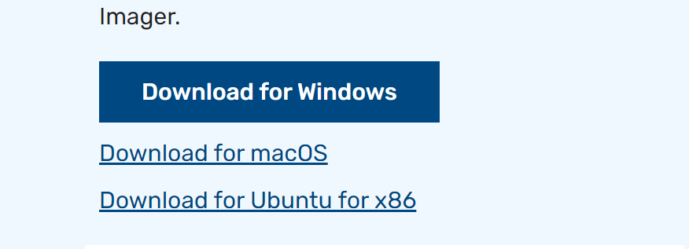

Start by installing a operating system on your Raspberry Pi. I am going to show how to download ubuntu.
First off insert the pi SD card into your computer.
Download raspberry imager from here: https://www.raspberrypi.com/software/ 

Now open the downloaded file and run it, press install then run the raspberry pi imager.

Press Choose Device under Raspberry Pi Device then select the Raspberry Pi model you have. In my case it is a Raspberry Pi 4.

