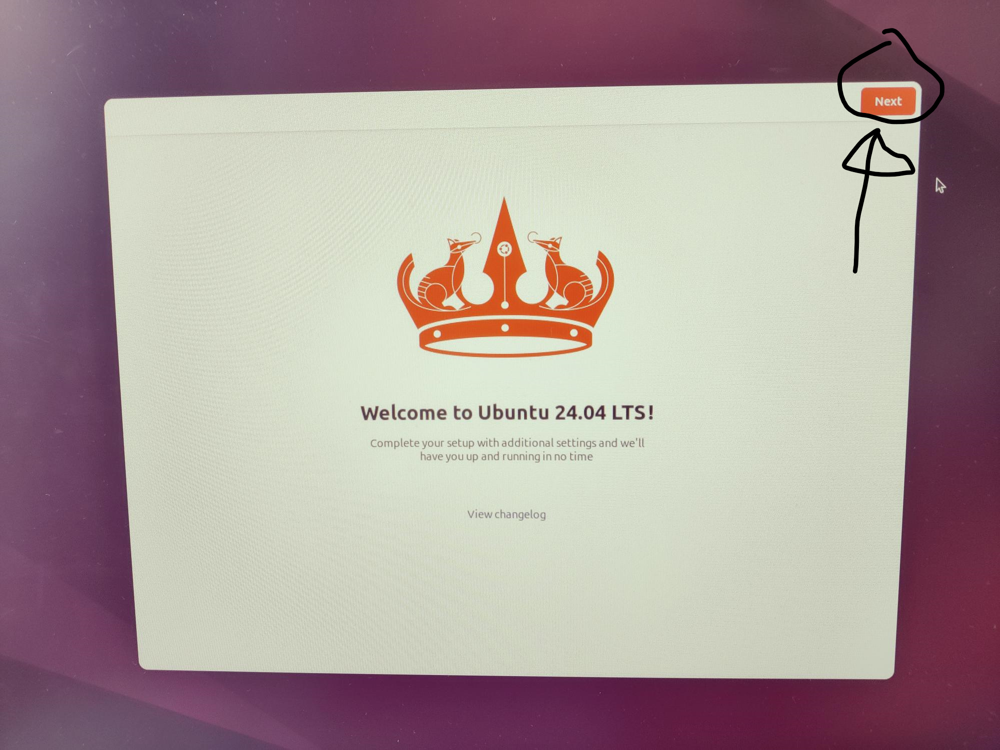
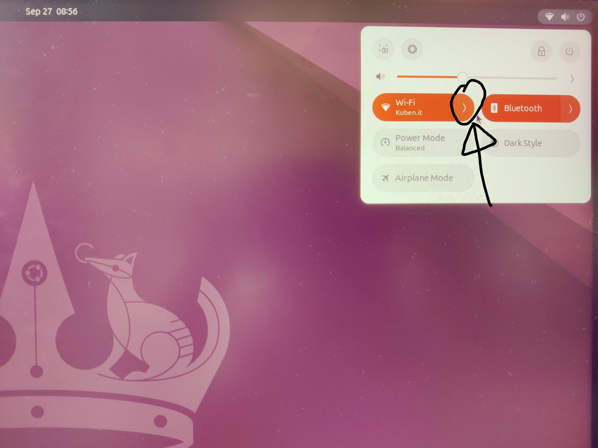
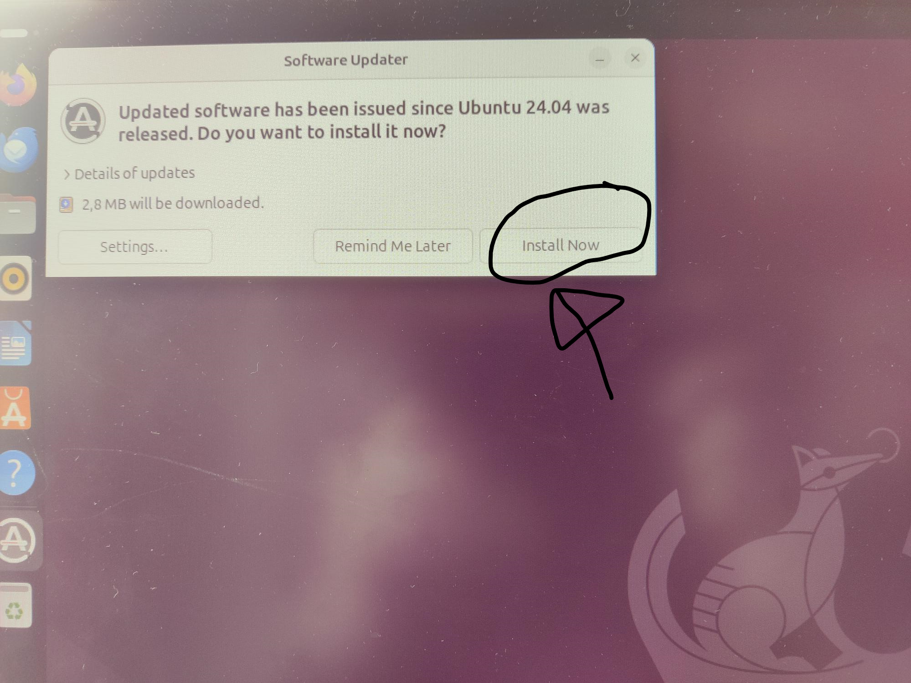
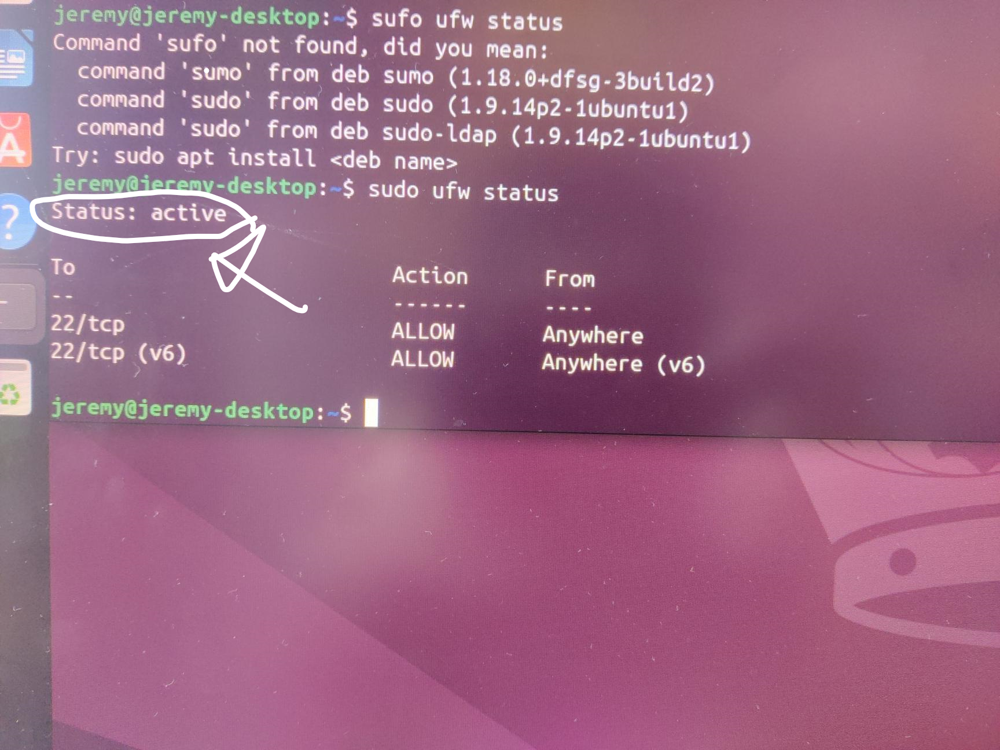
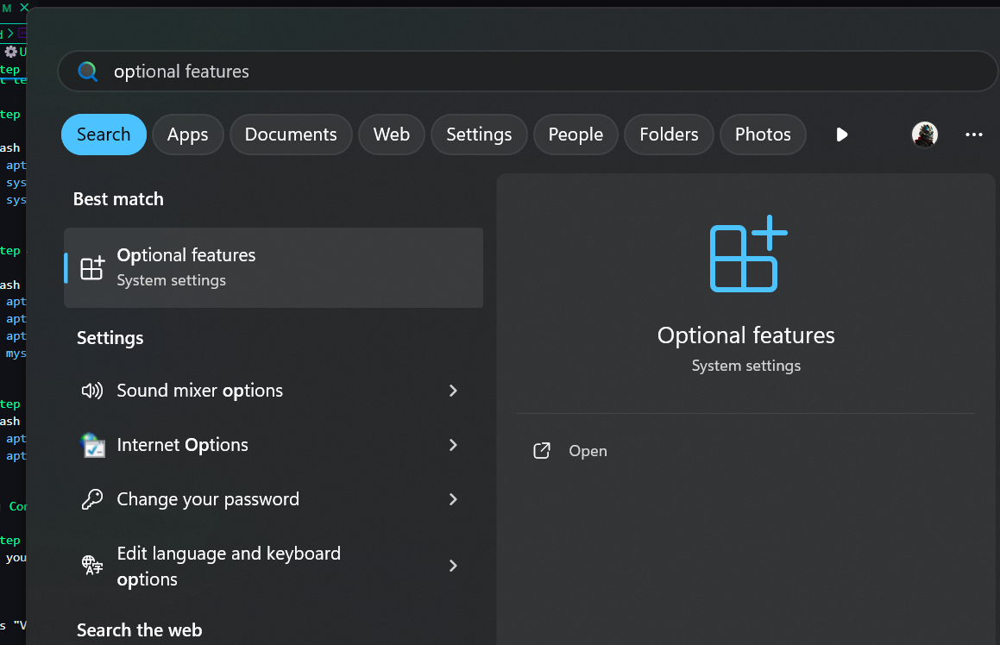
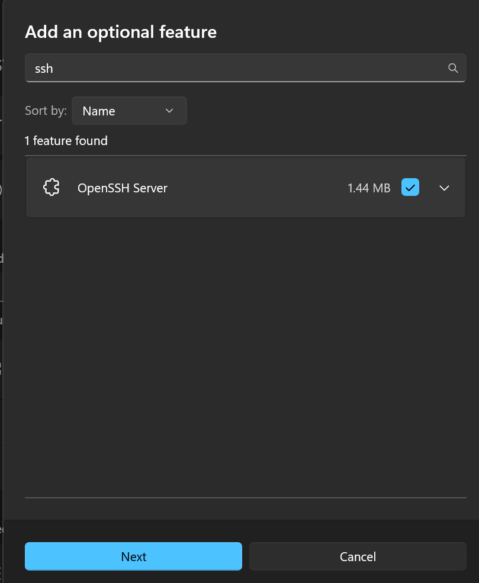
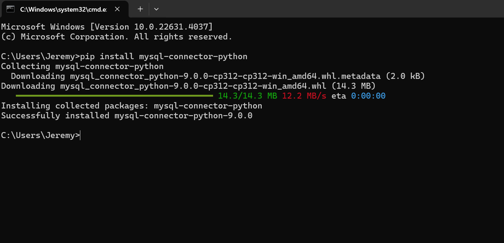

# 🍓 Installing Ubuntu on Your Raspberry Pi

## 📋prerequisites
- Raspberry Pi 4
- Computer with SD card reader
- A monitor for your Raspberry Pi
- Download python from [here](https://www.python.org/downloads/)
- Download git from [here](https://git-scm.com/downloads)

## 📥 Preparation

1. Insert the Pi SD card into your computer.
2. Download Raspberry Pi Imager from [here](https://www.raspberrypi.com/software/).


## 🚀 Installation Process

### Step 1: Launch Raspberry Pi Imager installer

Open the downloaded file and run it. Click "Install" and then run the Raspberry Pi Imager.


### Step 2: Choose Your Device

1. Click "Choose Device" under Raspberry Pi Device.
2. Select your Raspberry Pi model.


> In this guide, we're using a Raspberry Pi 4.


### Step 3: Select Operating System

We'll be installing Ubuntu in this guide.

1. Click "Choose OS".
2. Scroll down and select "Other general-purpose OS".


3. Select "Ubuntu".


4. Choose the appropriate version based on your Pi's RAM:
   - 4+ GB RAM: Select the top option
   - Less than 4 GB RAM: Select the bottom option


### Step 4: Choose Storage

1. Click "Choose Storage".
2. Select your Pi SD card.


### Step 5: Install Ubuntu

1. Click "Next".
2. Click "Yes" to confirm.

> ⚠️ **WARNING**: This will erase all data on your SD card to install Ubuntu.


### Step 6: Complete Installation

Wait for the installation to complete. You'll see this prompt when it's done:


## 🖥️ First Boot

1. Remove the SD card from your computer and insert it into the Raspberry Pi.
2. Connect the Pi to your monitor using the display cable.
3. Power on the Raspberry Pi.

> 🔄 Boot process:
> 1. Rainbow screen (a few seconds)
> 2. Black screen
> 3. Ubuntu logo with a throbber

> 🛠️ Troubleshooting: If stuck on the rainbow screen, check if the display cable is connected to the correct port on the Pi.

## 🎉 Ubuntu Setup

1. Select your language and click "Continue".
2. Choose your keyboard layout and click "Continue".
3. Set your location (city) and click "Continue" (or press on your location on the map).
4. Enter your personal details:
   - Name
   - Computer name
   - Username
   - Password
5. Wait for Ubuntu to complete the configuration.
6. Click the username and enter your password, now you should be on the Ubuntu desktop and see a welcome screen.

.jpg>)

7. Just press next at the top right corner of the welcome screen.



8. If you wish to you can enable Ubuntu Pro and press next.
9. Choose if you want to share your data with the Ubuntu Foundation and press next.
10. Finally press finish.
11. If you don't have an ethernet cable, you can connect to a wifi network by pressing the tip right corner. the the arrow next to wifi, then select your network, input password and connect.



12. At the top left of your screen you should see a message asking if you want to update your system, select Install now.



Congratulations! You've successfully installed Ubuntu on your Raspberry Pi! 🎊

# 💻⚙️Update system and install additional software.


## Step 1 - Update System
Open a terminal by pressing ctrl+alt+t

Write the following commands:

```bash
sudo apt update
sudo apt upgrade
```
If they ask for a password, enter the one you made for your Ubuntu user.
whe nthey ask for confirmation, type "y" and press enter.

## Step 2 - Set up firewall

Set up firewall:

```bash
sudo apt install ufw
sudo ufw enable
sudo ufw allow ssh
```
Now you can check the firewall status with:
```bash	
sudo ufw status
```
If it says Status: active at the top, you're good to go.



## Step 3 - Install and enable SSH

```bash
sudo apt install openssh-server
sudo systemctl enable ssh
sudo systemctl start ssh
```

## step 4 Install additional software

```bash
sudo apt install git
sudo apt install python3-pip
sudo apt install mariadb-server
sudo mysql_secure_installation
```

## step 5 - update again
```bash
sudo apt update
sudo apt upgrade
```

# 📟 Control your Pi with from pc with SSH

## Step 1 - Check if SSH is enabled
Open your windows search meny and look up: optional features and press that.



Press "View features" look up openssh, make sure it is selected and press next then add.



## Step 2 - Find your Pi's IP address

Open a terminal by pressing ctrl+alt+t
Write the following command:

```bash
Hostname -I
```

open windows control panel and write this:

```bash
ssh username@ip
```
⚠️ Replace "username" with the PI username you made and the replace "ip" with the IP address you found in step 2.
when asked: "Are you sure you want to continue connecting (yes/no/)?" write "yes" then press enter.
Input the password you made for your PI user and press enter.

Install SQL Connector on windows pc , by opening terminal and writing: pip install mysql-connector-python i
Dowload 