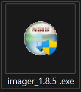

# 🍓 Installing Ubuntu on Your Raspberry Pi

## 📥 Preparation

1. Insert the Pi SD card into your computer.
2. Download Raspberry Pi Imager from [here](https://www.raspberrypi.com/software/).

## 🚀 Installation Process

### Step 1: Launch Raspberry Pi Imager installer

Open the downloaded file and run it. Click "Install" and then run the Raspberry Pi Imager.

### Step 2: Choose Your Device

1. Click "Choose Device" under Raspberry Pi Device.
2. Select your Raspberry Pi model.

> In this guide, we're using a Raspberry Pi 4.

### Step 3: Select Operating System

We'll be installing Ubuntu in this guide.

1. Click "Choose OS".
2. Scroll down and select "Other general-purpose OS".

3. Select "Ubuntu".

4. Choose the appropriate version based on your Pi's RAM:
   - 4+ GB RAM: Select the top option
   - Less than 4 GB RAM: Select the bottom option

### Step 4: Choose Storage

1. Click "Choose Storage".
2. Select your Pi SD card.

### Step 5: Install Ubuntu

1. Click "Next".
2. Click "Yes" to confirm.

> ⚠️ **WARNING**: This will erase all data on your SD card to install Ubuntu.

### Step 6: Complete Installation

Wait for the installation to complete. You'll see this prompt when it's done:

## 🖥️ First Boot

1. Remove the SD card from your computer and insert it into the Raspberry Pi.
2. Connect the Pi to your monitor using the display cable.
3. Power on the Raspberry Pi.

> 🔄 Boot process:
> 1. Rainbow screen (a few seconds)
> 2. Black screen
> 3. Ubuntu logo with a throbber

> 🛠️ Troubleshooting: If stuck on the rainbow screen, check if the display cable is connected to the correct port on the Pi.

## 🎉 Ubuntu Setup

1. Select your language and click "Continue".
2. Choose your keyboard layout and click "Continue".
3. Set your location (city) and click "Continue" (or press on your location on the map).
4. Enter your personal details:
   - Name
   - Computer name
   - Username
   - Password
5. Wait for Ubuntu to complete the configuration.
6. Click the username and enter your password, now you should be on the Ubuntu desktop and see a welcome screen.
7. Just press next at the top right corner.
8. If you wish to you can enable Ubuntu Pro and press next.
9. Choose if you want to share your data with the Ubuntu Foundation and press next.
10. Finally press finish.
11. At the top left of your screen you should see a message asking if you want to update your system, select Install now.

Congratulations! You've successfully installed Ubuntu on your Raspberry Pi! 🎊

##